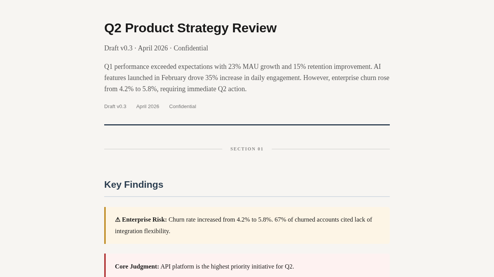
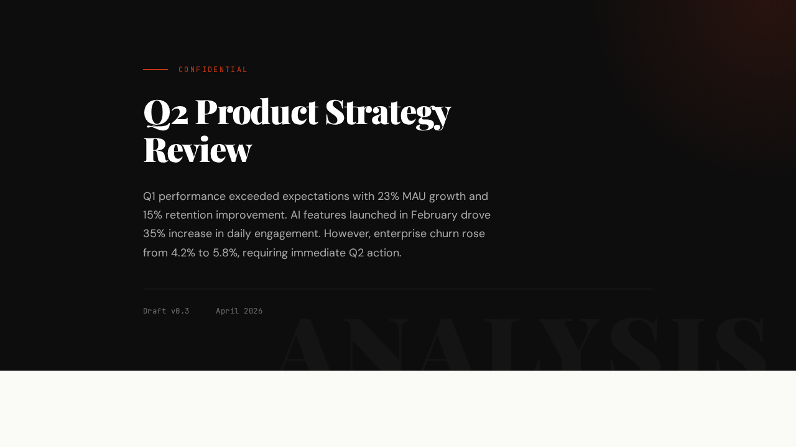
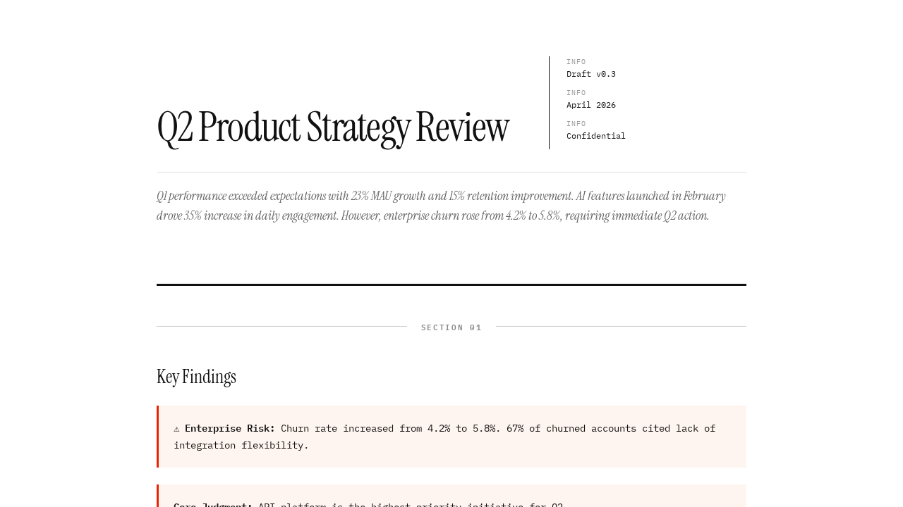
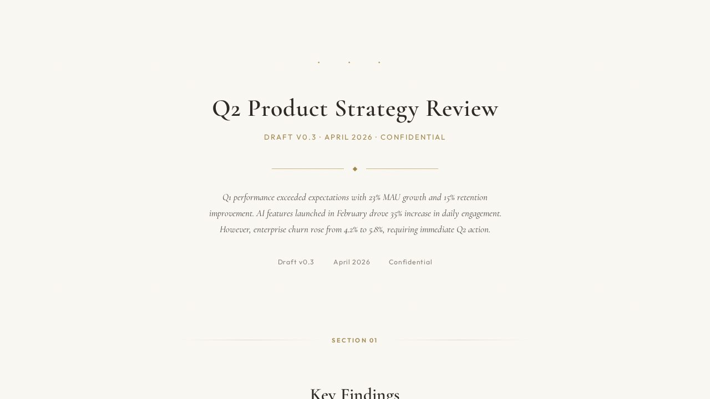

# Doc Review Skill

An agent skill for Claude Code, Codex, OpenClaw, and similar coding-agent environments that deploys password-protected document review pages to Cloudflare Pages with inline text annotations and persistent comments.

## Features

- **Inline Annotations** — Reviewers select any text to add comments (W3C TextQuoteSelector for precise positioning)
- **Persistent Comments** — Stored in Cloudflare D1 (serverless SQLite)
- **Password Protected** — Every page requires a password via Cloudflare Secrets (auto-generated if not specified)
- **4 Themes** — editorial, magazine, swiss, refined
- **Iterative** — Re-deploy after addressing feedback; old annotations auto-disappear
- **Auto D1 Creation** — Each project gets a dedicated D1 database automatically
- **Change Password** — Update password without redeploying content

## Prerequisites

- Cloudflare account with API token (needs **D1 Edit** permission)
- Node.js (for `npx wrangler`)
- Any AI agent with shell access (Claude Code, Codex, OpenClaw, Cursor, etc.)

## Installation

### Claude Code

```bash
git clone https://github.com/FuzzyTG/doc-review-skill.git ~/.claude/skills/doc-review-skill
```

Verify: `ls ~/.claude/skills/doc-review-skill/` should show `SKILL.md`, `references/`, `scripts/`.

### OpenClaw

```bash
openclaw skill install FuzzyTG/doc-review-skill
```

Or clone manually:
```bash
git clone https://github.com/FuzzyTG/doc-review-skill.git ~/.openclaw/skills/doc-review
```

### Other agents / manual

Clone anywhere and point your agent to the `SKILL.md`:
```bash
git clone https://github.com/FuzzyTG/doc-review-skill.git
```

### Paste-to-AI install

> Install the `doc-review-skill` skill for me. Steps:
>
> 1. Make sure `~/.claude/skills/` exists (create if not)
> 2. Run `git clone https://github.com/FuzzyTG/doc-review-skill.git ~/.claude/skills/doc-review-skill`
> 3. Verify: `ls ~/.claude/skills/doc-review-skill/` should show `SKILL.md`, `references/`, `scripts/`
> 4. Tell me when done.

Paste this into Claude Code, Cursor, or any AI agent with shell access.

### Trigger phrases

Once installed, the skill is triggered by:

- "Deploy this document for review"
- "Create a review page for this report"
- "Check feedback on my review page"
- "发布这个文档收集批注"
- "查看批注"

## Configuration

Cloudflare credentials are resolved in this order (first match wins):

1. **Environment variables** (simplest): `CLOUDFLARE_ACCOUNT_ID` + `CLOUDFLARE_API_TOKEN`
2. **`~/.doc-review/credentials/cloudflare.json`**:
   ```json
   {
     "account_id": "your-account-id",
     "api_token": "your-api-token"
   }
   ```
3. **`~/.openclaw/credentials/cloudflare.json`** (backward compat for OpenClaw users)

## Usage

Once installed, tell your agent:

> "Deploy this document for review"
> "Create a review page for this report"
> "发布这个文档收集批注"

### Deploy

```bash
# Basic deploy (password auto-generated)
bash scripts/deploy.sh my-report-review /path/to/html-dir

# With specific password
bash scripts/deploy.sh my-report-review /path/to/html-dir --password mypassword
```

**Note:** Project name must end with `-review`. The D1 database is created automatically — no need to specify database name or ID.

### Change Password

```bash
bash scripts/deploy.sh my-report-review --change-password newpassword
```

This updates the Cloudflare Secret and redeploys from the saved snapshot.

### How Passwords Work

Passwords are stored as **Cloudflare Secrets** (`PAGE_PASSWORD` and `PAGE_SECRET`), never in source code or config files. The middleware reads secrets from the environment at runtime.

- `PAGE_PASSWORD` — the plaintext password reviewers enter
- `PAGE_SECRET` — a derived hash used for cookie signing: `cloudflare-pages-auth-$(echo -n 'yourpassword' | sha256sum | cut -d' ' -f1)`

## Themes

### Editorial — Long-form analysis (default)
Warm gray, serif body, 740px narrow column. Best for deep analysis, research reports.



### Magazine — Dramatic editorial
Dark hero header, Playfair Display headings, red accent, section numbering. Best for high-impact reports.



### Swiss — International style
Pure white, IBM Plex Mono, black+red+blue grid layout, 900px. Best for technical specs, engineering docs.



### Refined — Premium feel
Cream background with parchment texture, Cormorant Garamond, gold + sage accents, 700px centered. Best for executive briefs.



## How It Works

1. Tell your agent to deploy a document for review
2. Agent generates themed HTML, injects the annotation system, and deploys to Cloudflare Pages
3. Share the URL + password with reviewers
4. **Reviewers select any text and leave inline comments** — no login required, comments persist in Cloudflare D1
5. **Ask your agent to check feedback** — it queries D1 directly, reads all annotations and comments, then iterates on the document based on reviewer input
6. Redeploy the updated version — old annotations on changed text auto-disappear

The key value: **your agent closes the feedback loop automatically.** Reviewers comment → agent reads → agent revises → redeploy. No manual copy-pasting of feedback.

## Migration from v3

If you're upgrading from v3.x (OpenClaw-only) and have existing published content at `~/.openclaw/published-content/`:

```bash
# Preview what will be migrated
bash scripts/migrate.sh --dry-run

# Run the migration
bash scripts/migrate.sh --yes
```

The migration script:
- Moves published-content projects from `~/.openclaw/published-content/` to `~/.doc-review/published-content/`
- Creates a symlink at the old path so nothing breaks during transition
- Does NOT touch credentials — deploy.sh discovers them automatically

## File Structure

```
├── SKILL.md                          # Agent instructions
├── references/
│   ├── render.js                     # Theme renderer
│   ├── annotate-template.html        # Annotation UI (JS + CSS)
│   ├── annotations-api.js            # D1 API for annotations
│   ├── middleware-template.js         # Password protection middleware
│   └── themes/
│       ├── editorial.css
│       ├── magazine.css
│       ├── swiss.css
│       └── refined.css
└── scripts/
    ├── deploy.sh                     # Deployment script
    ├── inject-annotations.sh         # HTML injection helper
    ├── md2html.sh                    # Markdown to HTML baseline
    └── migrate.sh                    # v3 → v4 migration
```

## License

MIT
